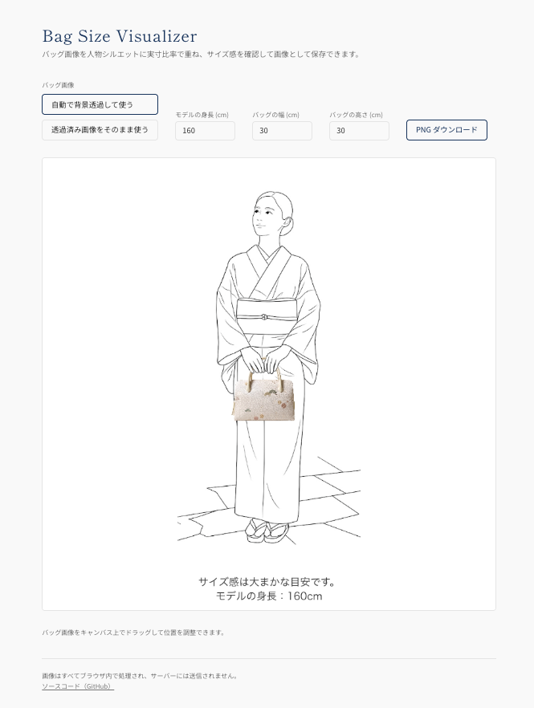

# Bag Size Visualizer

バッグの画像を人物シルエットに**実寸比率**で重ね、サイズ感を確認して画像（PNG）として保存できる Web ツールです。

着物に合わせるバッグをオンラインで販売する際、寸法（cm）だけではお客様にサイズ感が伝わりにくいことがあります。このツールは、人物シルエットに実寸比率でバッグを重ねた画像を手軽に作り、商品ページに掲載できるようにすることを目的としています。

🔗 **ライブデモ: https://bag-size-visualizer.ifukazoo.workers.dev**

すべての処理は**ブラウザ内で完結**します。アップロードした画像がサーバーに送信されることはありません。

## 特長

- バッグ画像をアップロードすると、人物シルエットに重ねてサイズ感を可視化
- モデルの身長・バッグの幅／高さ（cm）を指定して**実寸比率**で描画
- バッグ画像をドラッグして位置を調整
- 結果を PNG でダウンロード（1080×1080）
- 画像処理はすべてブラウザ内（プライバシーに配慮・サーバー送信なし）

## バッグ画像の入れ方（2通り）

| 入口 | 用途 |
|---|---|
| **自動で背景透過して使う** | 背景つきの写真をアップロードすると、ブラウザ内で自動的に背景を透過して合成します |
| **透過済み画像をそのまま使う** | あらかじめ背景を透過した PNG を、加工せずそのまま使います |

### 自動背景透過の注意

自動背景透過は [`@imgly/background-removal`](https://github.com/imgly/background-removal-js) を使い、来訪者のブラウザ内で実行します。

- 初回はモデル（約 50MB）のダウンロードに時間がかかります。
- **被写体と背景のコントラストが低い場合**（例: 淡い色のバッグを明るい背景で撮影）、バッグ本体まで背景と判定されてうまく抜けないことがあります。その場合は、画像編集ソフトであらかじめ背景を透過した PNG を用意し、「透過済み画像をそのまま使う」からアップロードしてください。

## ライセンス

[MIT License](LICENSE) © 2026 ifukazoo

同梱のシルエット画像（`src/assets/silhouette.png`, `src/assets/silhouette_hands.png`）は AI 生成によるもので、本リポジトリのライセンス（MIT）に含まれます。
